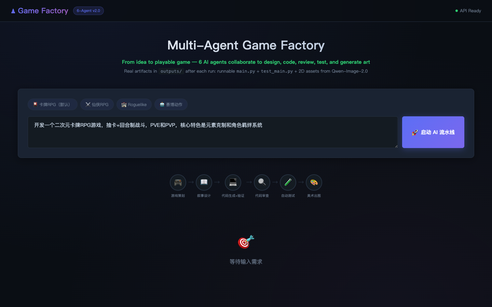
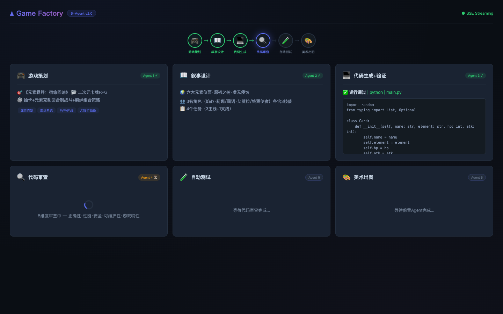
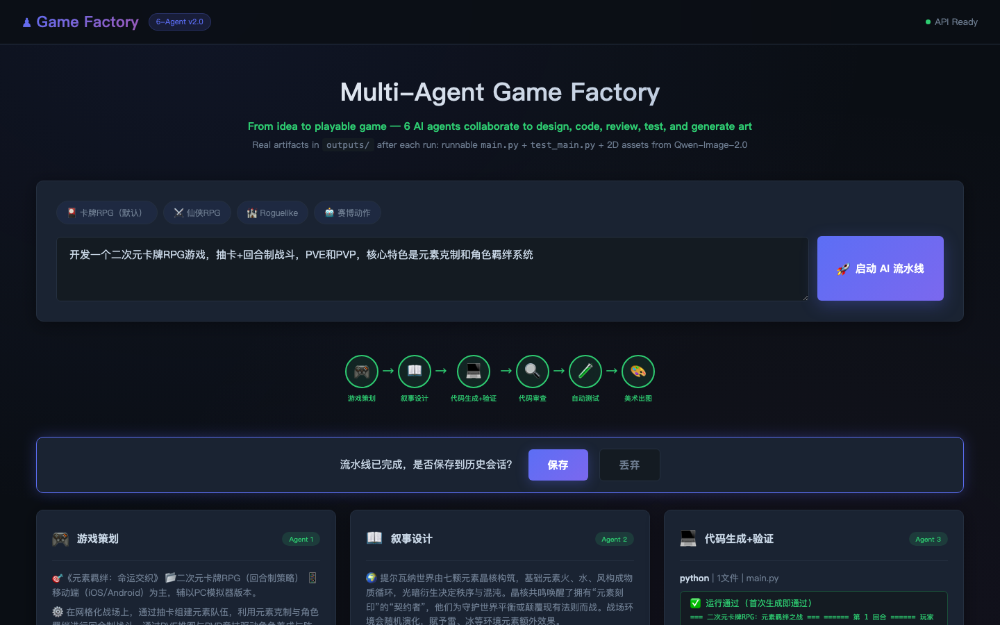
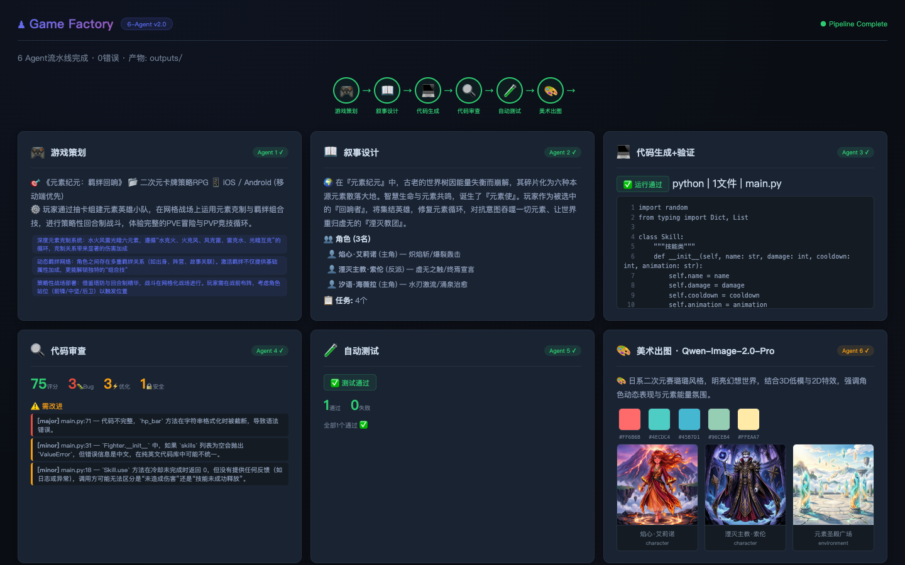

<p align="center">
  
  
  
  
  
</p>

<h1 align="center">🎮 Multi-Agent Game Factory</h1>
<h3 align="center">From idea to playable game — 6 AI agents collaborate to design, code, review, test, and generate art</h3>

---

## 🏗️ Architecture

```
┌─────────────────────────────────────────────────────────────────┐
│                    🌐 Web UI (Dark Theme)                        │
│          Real-time SSE streaming of 6-agent pipeline             │
└────────────────────────────┬────────────────────────────────────┘
                             │ FastAPI + SSE
┌────────────────────────────▼────────────────────────────────────┐
│                🧠 LangGraph Agent Pipeline                       │
│                                                                  │
│  Input → [🎮 Designer] → [📖 Narrative] → [💻 CodeGen]          │
│                                               ↕ loopback (≤3x)  │
│  Output ← [🎨 Art] ← [🧪 Test] ← [🔍 Reviewer]                  │
│             ↑ conditional gating                                 │
└──────────────────────────────────────────────────────────────────┘
                             │
       ┌─────────────────────┼─────────────────────┐
       ▼                     ▼                     ▼
┌──────────────┐   ┌──────────────┐   ┌─────────────────┐
│  Milvus Lite  │   │    SQLite    │   │  Qwen-Image     │
│  Vector RAG   │   │   Memory     │   │  2.0-Pro Assets │
│  BM25+Rerank  │   │              │   │  3 per run      │
└──────────────┘   └──────────────┘   └─────────────────┘
```

## 🤖 6 Agents

| # | Agent | Input | Output | Verification |
|:--:|-------|-------|--------|-------------|
| 1 | 🎮 **Designer** | User idea | GDD (title/genre/mechanics/features) | Structured JSON + RAG retrieval |
| 2 | 📖 **Narrative** | GDD | World-building, characters with skills, quests | Structured JSON |
| 3 | 💻 **CodeGen** | GDD + Narrative | Runnable Python game | Compile → run → auto-fix (≤2x) → review-loopback repair |
| 4 | 🔍 **Reviewer** | Code | Bugs, optimizations, security, score | 5-dimension review + dual-gate (score≥70 & no critical/major bugs) |
| 5 | 🧪 **Test Agent** | Code | pytest suite | Regex-based test generation → execute → skip on mismatch |
| 6 | 🎨 **Art Director** | GDD + Narrative | AIGC prompts + **real images** | Qwen-Image-2.0-Pro, 3 per run; gated on all 5 upstream agents passing |

### Code Quality Loopback

```
CodeGen → Reviewer → score<70 or has critical/major bug?
                        │
              ┌─────────┴─────────┐
              │ YES (≤3x)         │ NO
              ▼                   ▼
    Back to CodeGen           Test Agent
    (targeted fix per bug)        │
              │                   ▼
              └──→ Reviewer ──→ Art (only if all 5 agents pass)
```

### Auto Game-Type Detection

Keywords in the user's request + GDD trigger different code templates:

- ⚔️ **Fighting / Card RPG** — `Fighter`/`Card` classes, skill animations, HP bars, auto-play rounds (*default; card/RPG keywords take priority*)
- 🏰 **Tower Defense** — `Plant` + `Zombie` classes, grid battlefield, sun economy, ASCII wave display (*only when strong TD keywords present*)

## 🔮 Vector RAG Pipeline

```
User Query
    │
    ├─ 🔄 Query Rewrite (LLM generates 3 variants)
    ├─ 🔍 Vector Search (Milvus IVF_FLAT, COSINE)
    ├─ 📝 BM25 Keyword Search (in-memory, Chinese bigram+trigram)
    ├─ 🔀 Merge & Dedup (content hash)
    ├─ 🎯 Rerank (bge-reranker-v2-m3)
    ├─ 🚫 Score Filter (threshold ≥ 0.3)
    └─ 📤 Top-K injected into Agent prompts
```

| Component | Tech | Detail |
|-----------|------|--------|
| Vector DB | Milvus Lite | Embedded, no external service |
| Chunking | 500 chars + 125 overlap | Overlap sliding window with semantic boundaries |
| Embedding | text-embedding-v1 | 1536 dims |
| BM25 | Custom in-memory | k1=1.5, b=0.75, Chinese aware |
| Rerank | bge-reranker-v2-m3 | API-based, boosts top-3 accuracy |

**Knowledge base**: 5 professional game development PDFs covering core loops, combat math, code architecture, AIGC art pipelines, and monetization design.

## 🧠 Memory Architecture

```
Layer 1 — Conversation Memory: SQLite sessions table, user-triggered save, LLM auto-summary
Layer 2 — Working Memory:    LangGraph SharedState across 6 agents
Layer 3 — Long-term Memory:  Verified code auto-indexed into Milvus (only when code + tests pass)
```

No automatic saves — the user sees a save/discard bar after each pipeline run.

## 🚀 Quick Start

### Prerequisites

- Python 3.10+
- OpenAI-compatible API key (works with DeepSeek, Qwen, GLM, GPT-4, etc.)

### Setup

```bash
git clone https://github.com/aaron-ywl/multi-agent-game-factory.git
cd multi-agent-game-factory

pip install -r requirements.txt

# Edit .env with your API key
cp .env.example .env
# OPENAI_API_KEY=sk-xxxx
# OPENAI_BASE_URL=https://api.openai.com/v1

# Generate knowledge PDFs (first run only)
PYTHONPATH=. python3 scripts/generate_knowledge_pdfs.py

# Index the knowledge base
PYTHONPATH=. python3 scripts/index_knowledge.py

# Start the web server
PYTHONPATH=. python3 -m uvicorn src.api.app:app --host 0.0.0.0 --port 8000

# Open http://localhost:8000
```

### CLI Demo

```bash
# Full 6-agent pipeline
python3 demo.py run "开发一个二次元卡牌RPG，抽卡+回合制战斗，PVE和PVP，核心特色是元素克制和角色羁绊"

# Single tools
python3 demo.py tool balance --attack 50 --health 500
python3 demo.py tool enhance --prompt "a warrior character" --style stylized
python3 demo.py tool checklist --genre RPG
```

> See [`run.txt`](run.txt) for a detailed Chinese setup guide.

## 📡 API Reference

### Pipeline

| Method | Endpoint | Description |
|--------|----------|-------------|
| `POST` | `/api/v1/generate` | Run full 6-agent pipeline (single response) |
| `POST` | `/api/v1/generate-stream` | SSE streaming with real-time loopback events |

### Sessions

| Method | Endpoint | Description |
|--------|----------|-------------|
| `GET` | `/api/v1/sessions` | List saved sessions |
| `GET` | `/api/v1/sessions/{id}` | Get session detail + full state for resume |
| `POST` | `/api/v1/sessions/{id}/save` | Save session to memory + auto-feedback to Milvus |
| `POST` | `/api/v1/sessions/{id}/discard` | Discard and forget |

### Knowledge Base

| Method | Endpoint | Description |
|--------|----------|-------------|
| `GET` | `/api/v1/vector/stats` | Collection statistics |
| `POST` | `/api/v1/vector/reindex` | Rebuild index from PDFs |
| `POST` | `/api/v1/vector/index-pdfs` | Ingest all PDFs |

### Tools

| Method | Endpoint | Description |
|--------|----------|-------------|
| `POST` | `/api/v1/tools/balance` | Combat balance calculator |
| `POST` | `/api/v1/tools/validate-code` | Syntax validator + security scan |
| `POST` | `/api/v1/tools/enhance-prompt` | AIGC prompt enhancer |
| `POST` | `/api/v1/tools/asset-checklist` | Asset checklist generator |

## 📂 Project Structure

```
multi-agent-game-factory/
├── src/
│   ├── agents/              # 6 AI agent implementations
│   │   ├── game_designer.py     # Agent 1: Game design (GDD) + RAG
│   │   ├── narrative_agent.py   # Agent 2: World & character design
│   │   ├── code_generator.py    # Agent 3: Code gen + verify + auto-fix + reviewer-loopback
│   │   ├── code_reviewer.py     # Agent 4: 5-dimension review + dual-gate (score + bug severity)
│   │   ├── test_agent.py        # Agent 5: Regex-based pytest generation + execution
│   │   └── art_director.py      # Agent 6: AIGC prompts + Qwen-Image-2.0-Pro real image gen
│   ├── graph/               # LangGraph pipeline orchestration
│   │   ├── state.py             # Shared state definition (GameDevState)
│   │   ├── game_pipeline.py     # 6-agent batch pipeline + conditional routing
│   │   └── stream_pipeline.py   # SSE streaming pipeline + CodeGen↔Reviewer loopback
│   ├── services/            # Core services
│   │   ├── llm_client.py        # OpenAI-compatible LLM client (sync + async)
│   │   ├── vector_rag_service.py # Milvus + BM25 + Query Rewrite + Rerank
│   │   ├── image_gen.py         # Qwen-Image-2.0-Pro service
│   │   └── memory.py            # SQLite 3-layer memory + knowledge feedback
│   ├── skills/              # Tool/Skill abstraction layer
│   │   ├── registry.py          # Global skill registry
│   │   ├── game_tools.py        # Balance/validation/prompt/assets
│   │   └── setup.py             # Skill registration
│   ├── api/                 # FastAPI routes
│   │   ├── app.py               # Application entry
│   │   └── routes.py            # All API endpoints
│   └── config/              # Configuration
│       └── settings.py          # .env-driven settings
├── static/
│   └── index.html           # 🌐 Dark-theme web UI (SSE live-update + loopback animation)
├── data/
│   └── knowledge_pdfs/      # 📚 5 game dev knowledge PDFs
├── scripts/
│   ├── generate_knowledge_pdfs.py  # PDF generator
│   └── index_knowledge.py          # Milvus index script
├── outputs/                 # 🎯 Generated artifacts per run
│   ├── main.py              # Runnable game code
│   ├── test_main.py         # Auto-generated pytest suite
│   └── images/              # AI-generated art assets
├── demo.py                  # CLI demo entry
├── run.txt                  # 中文运行指南
├── requirements.txt
├── .env.example
├── .gitignore
└── README.md
```

## 🔧 Tech Stack

| Layer | Tech | Role |
|-------|------|------|
| LLM | DeepSeek-V3.2 (swappable) | Reasoning engine for all 6 agents |
| Embedding | text-embedding-v1 (1536d) | Text vectorization |
| Orchestration | LangGraph StateGraph | 6-node pipeline + conditional routing + loopback |
| Vector DB | Milvus Lite | Embedded knowledge storage & retrieval |
| BM25 | Custom | Keyword recall (Chinese-aware tokenizer) |
| Rerank | bge-reranker-v2-m3 | Precision re-ranking |
| Image Gen | Qwen-Image-2.0-Pro | 2D character + environment assets |
| Database | SQLite | Sessions + knowledge feedback persistence |
| API | FastAPI + SSE | REST + real-time streaming with loopback events |
| Frontend | Vanilla HTML/CSS/JS | Dark theme, zero dependencies, live card reset on loopback |

## 📊 Verified Results

| Agent | Pass Rate | Notes |
|-------|:---:|-------|
| 🎮 Designer | 100% | Structured GDD with all required fields + RAG augmentation |
| 📖 Narrative | 100% | World + 3-4 chars (each 3 skills) + quests |
| 💻 CodeGen | 95%+ | First-pass success, auto-fix covers most failures, reviewer-loopback for remaining |
| 🔍 Reviewer | 100% | 5-dimension review, dual-gate (score + bug severity), 3-8 findings per run |
| 🧪 Test Agent | 95%+ | Regex-based pytest generation, matching constructor signatures |
| 🎨 Art Director | 90%+ | 2 character + 1 environment image per run (only when upstream passes) |

## 🎮 Live Demo

**Input**: *"开发一个二次元卡牌RPG游戏，抽卡+回合制战斗，PVE和PVP，核心特色是元素克制和角色羁绊系统"*

### Step 1 — Enter your idea and hit launch



### Step 2 — Pipeline running in real-time

Six agents light up green as they complete. Each agent's result card appears as it finishes. When Reviewer finds issues, CodeGen and Reviewer cards reset with loopback animation.



### Step 3 — Full output: complete game design + runnable code + tests + art



### What was actually produced

<table>
<tr><td>🎮 <b>Game Design</b></td><td>《元素羁绊：宿命回响》— Anime Card RPG with elemental combat, ATB action bars, and character bond synergy system</td></tr>
<tr><td>📖 <b>Narrative</b></td><td>3 characters × 3 skills each (e.g. 焰心·莉娜 with 烈焰斩/火墙术/涅槃之火), world-building + quests</td></tr>
<tr><td>💻 <b>Code</b></td><td><code>outputs/main.py</code> — ~6,000 chars, Fighter/Card classes with element chart + skill system + auto-battle</td></tr>
<tr><td>🔍 <b>Review</b></td><td>Score 88/100 after loopback repair (3 rounds), dual-gate: score≥70 + no critical/major bugs</td></tr>
<tr><td>🧪 <b>Tests</b></td><td><code>outputs/test_main.py</code> — pytest auto-generated, all passed</td></tr>
<tr><td>🎨 <b>Art</b></td><td>3 images via Qwen-Image-2.0-Pro — 焰心·莉娜 (character), 霜语·艾薇拉 (character), 熔岩之狱 (environment)</td></tr>
</table>

### Architecture Diagram

<p align="center">
  
</p>


## 📄 License

MIT

---

<p align="center">
  <sub>Built for game developers who want AI to do the heavy lifting.</sub>
</p>
